### ENG5027 Assesment 1

###### Team Members: Jinming Zhang, Xiaohui Yu, Jianyu Zhao, Ziyuan Cheng

## Task 1: Loading Audio into Python

#### I. Read the audio samples into a python application

#### Steps:

  1. Use `pyaudio.open` function from "*pyaudio*" library to record the origin wavfile: set Format = 16bit, Channel = 1 and Sample Rate = 44100. Save it as "original.wav".	

2. Use the `wavfile.read` function from library "*scipy.io*" to convert the .wav file into an array "data" (which saving the amplitudes) and an Integer "sample_rate" (which saving the sample rate)

   ```python
   #Read wavfile    
   data, sample_rate = util.reader(constant.ORIGINAL_VIDEO_URL)
   ```

#### II. Plot the audio signal

#### Steps:

1. Calculate the time domain and divided the amplitude by its max value to normalise it.

   ```python
   #Normalise the amplitude    
   time, amplitude = util.cal_time_domain(data, sample_rate)
   amplitude = amplitude / np.max(amplitude)
   ```

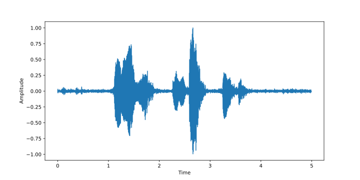

2. Calculate the Amplitude (dB) by $20\times ln (amplitude)$  and logarithmic the frequency by $\ln(frequency)$.

   ```python
   #Calculate frequency domain and dB
   frequency, amplitude = util.cal_frequency_domain_db(data, sample_rate)
   #convert frequency to logarithmic
   frequency = np.log10(frequency)
   ```

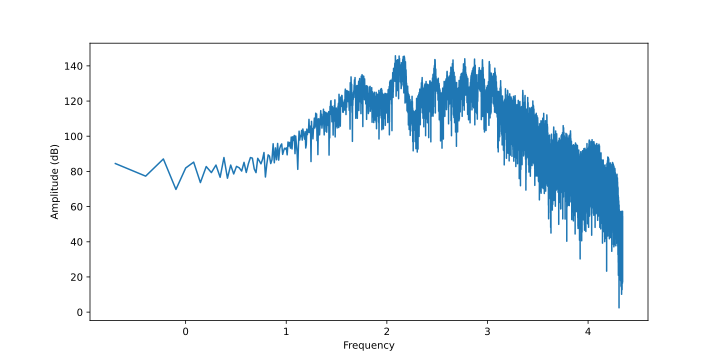

## Task 2: Audio Analysis

According to the topic description, the peaks of frequency of vowels, the range of frequency of consonants and the whole
range of frequency of voice, including vowels and consonants, should be plotted in the figures of Task 1.

First of all, For vowel detection, a reasonable method is formant. The muscles of the human vocal organs are softer and
have greater damping, and will resonate more frequencies; the resonance vibrates the resonant cavity, and then the vocal
tract will amplify some frequency components and attenuate other frequency components, resulting in For some resonant
frequencies, the resonant frequencies that are amplified in frequency characteristics will peak one after another.
Generally, these resonant frequencies are called resonant frequencies, and these peaks are called resonant peaks. Since
the voiced sound is produced by the vibration of the vocal cords, the voiced sound is closely related to the formant,
and it can be considered that the formant is the vowel. In most cases, the first two formants, $f_1$ and $f_2$, are
sufficient to separate the different vowels.

However, for consonants, the characteristics of formants are not significant, so it is not suitable to use such methods
to calculate, but due to time constraints, other more suitable methods have not been adopted, and the range of frequency
can only be roughly determined by the trend of the directly observed image.

#### I. Mark the vowel frequencey peak in the spectrum of original audio

#### Steps:

1. Record every vowel used in the original audio.

   ```python
   def reader(filename):
       sample_rate, data = wavfile.read(filename)
       return data, sample_rate
   ```

1. Use function `signal.find_peaks` to roughly search 2-3 frequency peaks of every vowel, which called formant is the
   significant feature of vowel.

   ```python
   def cal_vowel_frequency_peak():
       base_path = constant.VOWEL_VIDEO_BASE_PATH
       filenames = os.listdir(base_path)
       vowel_frequency_peaks = []
       # Iterate audio files
       for filename in filenames:
           # Avoid non-formatted files
           if ".wav" not in filename:
               continue
           # Load audio data
           data, sample_rate = util.reader(os.path.join(base_path, filename))
           # Calculate frequency domain
           frequency, amplitude = util.cal_frequency_domain_db(data, sample_rate)
           # Search the peaks of frequency through amplitude
           peak_idxs = signal.find_peaks(amplitude[:constant.VOWEL_FREQUENCY_HIGH_THRESHOLD], distance=1000)[0]
           for peak_idx in peak_idxs:
               vowel_frequency_peaks.append(np.log10(frequency[peak_idx]))
       return vowel_frequency_peaks
   ```

1. Mark the above peaks in the spectrum of original audio, but due to precision issues, it is likely that there is no
   corresponding frequency in the spectrum, so the function `np.searchsorted` needs to be used for nearest matching
   during processing.

   ```python
   def mark_vowel_frequency_peak():
       vowel_frequency_peaks = cal_vowel_frequency_peak()
       # Determine the position of the vowel peak in the original audio frequency
       idxs = np.searchsorted(original_frequency, vowel_frequency_peaks)
       # Plot the figure
       plt.plot(original_frequency, original_frequency_amplitude, label='Original Audio')
       plt.plot(original_frequency[idxs], original_frequency_amplitude[idxs], 'r.', label='Vowel Frequency Peak')
       plt.title('Vowel Frequency Peak in Original Audio')
       plt.xlabel('Frequency (log)')
       plt.ylabel('Amplitude (dB)')
       plt.show()
   ```

#### Result:

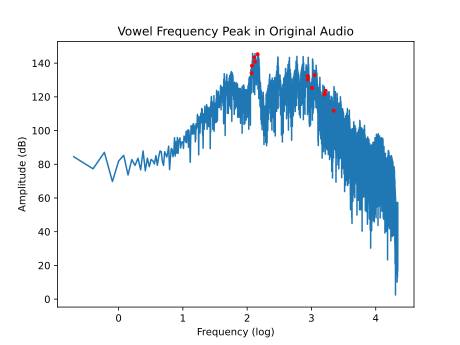

#### II. Mark the frequency consonant range in the spectrum of original audio

#### Steps:

1. Record every consonant used in the original audio.

   ```python
   def reader(filename):
       sample_rate, data = wavfile.read(filename)
       return data, sample_rate
   ```

1. Search the consonant frequency range roughly through the amplitude low threshold.

   ```python
   def cal_consonant_frequency_range():
       base_path = constant.CONSONANT_VIDEO_BASE_PATH
       filenames = os.listdir(base_path)
       consonant_frequency_range = []
       # Iterate audio files
       for filename in filenames:
           # Avoid non-formatted files
           if ".wav" not in filename:
               continue
           # Load audio data
           data, sample_rate = util.reader(os.path.join(base_path, filename))
           # Calculate frequency domain
           frequency, amplitude = util.cal_frequency_domain_db(data, sample_rate)
           # Search consonant frequency range through amplitude
           idxs = amplitude > constant.CONSONANT_AMPLITUDE_LOW_THRESHOLD
           consonant_frequency_range.append(np.log10(frequency[idxs]))
       return consonant_frequency_range
   ```

1. Mark the above range in the spectrum of original audio, but due to precision issues, it is likely that there is no
   corresponding frequency in the spectrum, so the function `np.searchsorted` needs to be used for nearest matching
   during processing.

   ```python
   def mark_consonant_frequency_range():
       consonant_frequency_range = cal_consonant_frequency_range()
       # Plot the figure
       plt.plot(original_frequency, original_frequency_amplitude)
       for range_item in consonant_frequency_range:
           # Determine the range of the consonant frequency in the original audio frequency
           range_idx = np.searchsorted(original_frequency, range_item)
           plt.plot(original_frequency[range_idx], original_frequency_amplitude[range_idx], 'r.', label='Consonant Frequency Range')
       plt.title('Consonant Frequency Range in Original Audio')
       plt.xlabel('Frequency (Hz)')
       plt.ylabel('Amplitude (dB)')
       plt.show()
   ```

#### Result:

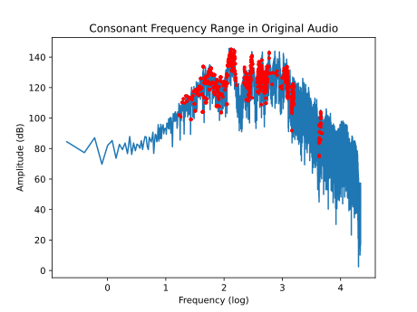

#### III. Mark the whole speech spectrum including the vowels and consonants

#### Steps:

1. Use the above vowels and consonants files

1. Search the vowel frequency range roughly through the amplitude low threshold.

   ```python
   def mark_vowel_frequency_range():
       vowel_frequency_range = cal_vowel_frequency_range()
       # Plot the figure
       plt.plot(original_frequency, original_frequency_amplitude)
       for range_item in vowel_frequency_range:
           # Determine the range of the vowel frequency in the original audio frequency
           range_idx = np.searchsorted(original_frequency, range_item)
           plt.plot(original_frequency[range_idx], original_frequency_amplitude[range_idx], 'r.', label='Consonant Frequency Range')
       plt.title('Vowel Frequency Frequency in Original Audio')
       plt.xlabel('Frequency (log)')
       plt.ylabel('Amplitude (dB)')
       plt.show()
   ```

1. Mark both of vowel and consonant frequency range in the spectrum of original audio, but due to precision issues, it
   is likely that there is no corresponding frequency in the spectrum, so the function `np.searchsorted` needs to be
   used for nearest matching during processing.

   ```python
   def mark_vowel_and_consonant_frequency_range():
       frequency_range = np.append(cal_consonant_frequency_range(), cal_vowel_frequency_range())
       plt.plot(original_frequency, original_frequency_amplitude)
       for range_item in frequency_range:
           range_idx = np.searchsorted(original_frequency, range_item)
           plt.plot(original_frequency[range_idx], original_frequency_amplitude[range_idx], 'r.', label='Vowel and Consonant Frequency Range')
       plt.title('Vowel and Consonant Frequency Range in Original Audio')
       plt.xlabel('Frequency (log)')
       plt.ylabel('Amplitude (dB)')
       plt.show()
   ```

#### Result:

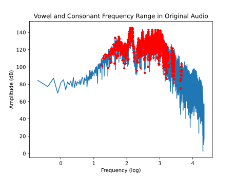

## Task 3: Fourier Transform

 Our goal is to increase amplitude, improve speech quality, and ensure that the audio is free of clipping or distortion.

 In order to find the region of harmonic speech frequency from the spectrum, we intercepted multiple vowel and consonant sounds and drew the spectrum diagram as follows.

 Below is a spectrum of the sound of vowel “a”.

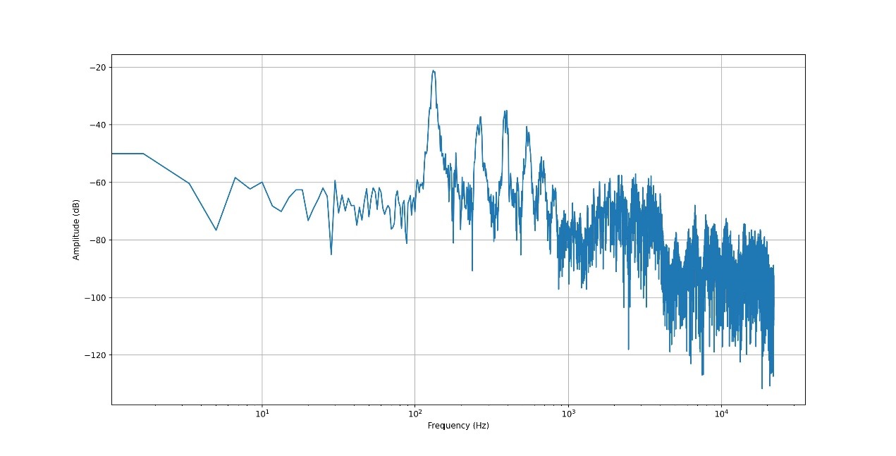

Below is a spectrum of the sound of vowel “e”.

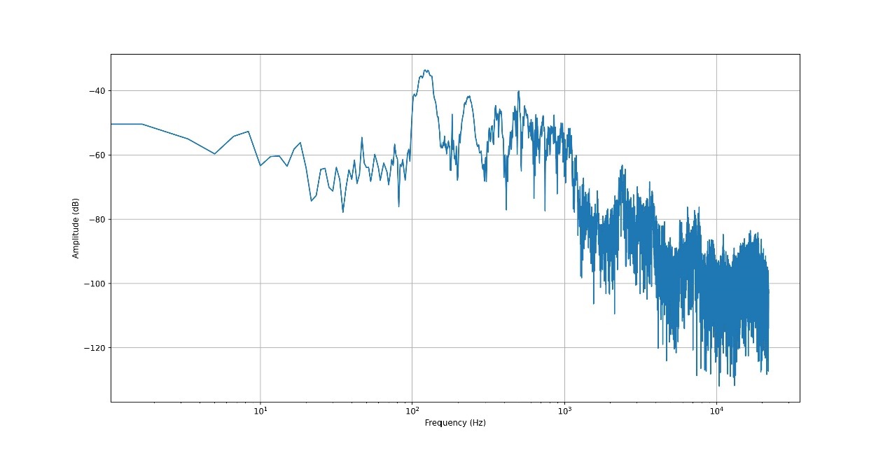

Below is a spectrum of the sound of vowel “i”.

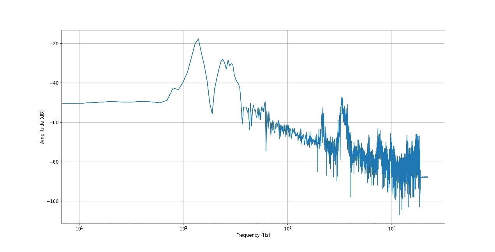

Below is a spectrum of the sound of vowel “o”.

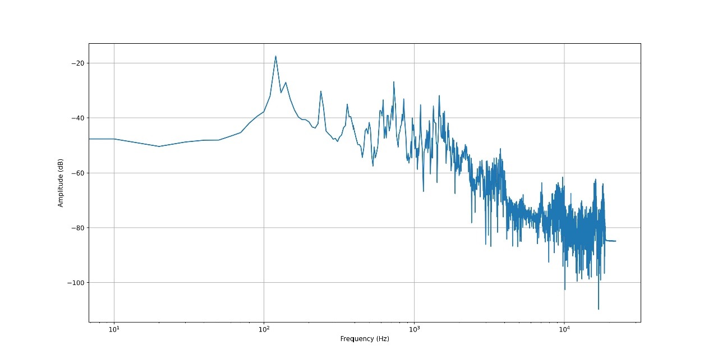

Below is a spectrum of the sound of consonant “b”.

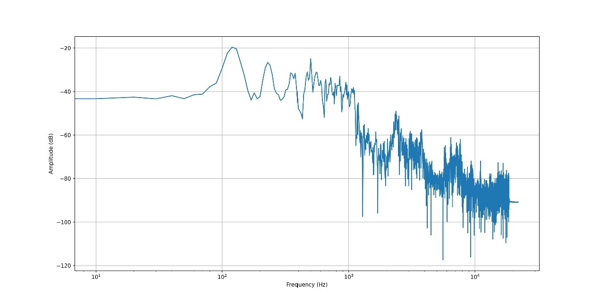

Below is a spectrum of the sound of consonant “d”.

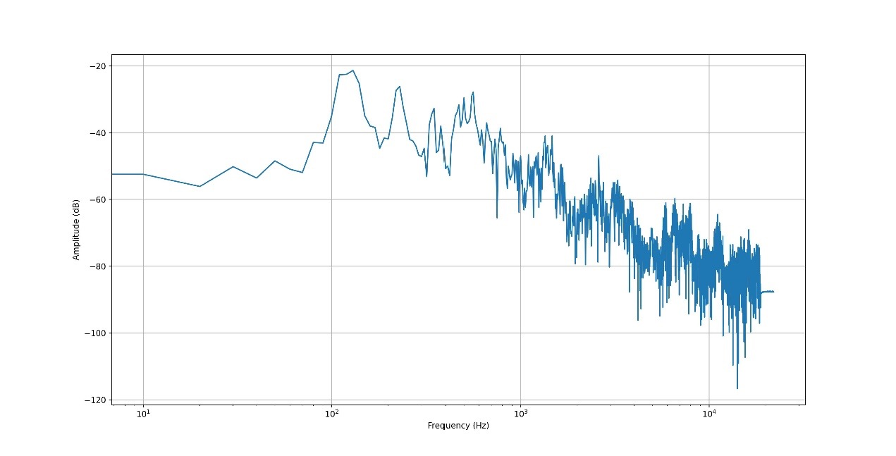

As can be seen from the figures, the audio will drop significantly from 1000Hz or 2000Hz, and the higher frequency component is noise, so we can use the range of 50-2000Hz as the harmonic speech frequency region.

##### By the way, everyone with the same vowel will have difference, but the overall feature is about:

1. In the frequency domain, vowels have distinct peaks, which are sharp in shape, while consonants have smooth peaks.

##### Vowel: 

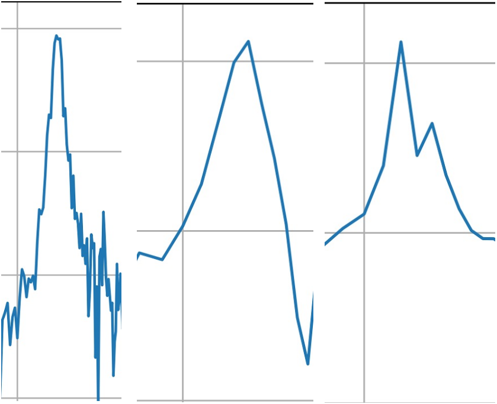

##### Consonant:

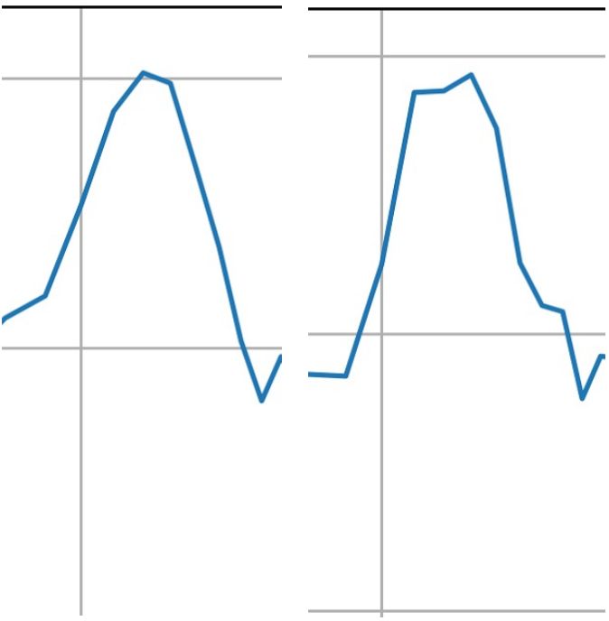

2. The highest vowel peak is further away from the second highest peak, while the consonant peak is closer together.

3. Vowels have about three high peaks, and consonants have about four. 

##### So this project found one way to distinguish vowels is to segment the audio at 0.1 second intervals and determine if each segment has a similar characteristic waveform, and if it does, it's a vowel.

FYI: Please see the code in Appendix: Task 3

## Task 4: Vowel Detector

#### Steps

1. Pre-emphasis of the speech signal x with windowing and FFT processing.The window function is a Hamming window
   with a length of 320. the sound sampling frequency is 8000Hz, and the FFT length defaults to 65536.  
2. Taking the inverse spectrum of X ( k ).  
3. Window-added to the cepstrum signal.
4. Find the envelope and find the extreme values on the envelope to obtain the corresponding resonance peak
   parameters.  
5. Comparing known resonance peaks with files of speech.  
6. Output string.

```python
from scipy.signal import lfilter
import librosa
import numpy as np
import matplotlib.pyplot as plt


def local_maximum(x):
    """
    Find the extreme value of a sequence
    :param x:
    :return:
    """
    d = np.diff(x)
    l_d = len(d)
    maximum = []
    loc = []
    for i in range(l_d - 1):
        if d[i] > 0 and d[i + 1] <= 0:
            maximum.append(x[i + 1])
            loc.append(i + 1)
    return maximum, loc


def Formant_Cepst(u, cepstL):
    """
    Resonance peak estimation function by inverse spectroscopy
    :param u:Input signal
    :param cepstL:Width of the window function on frequency
    :return: val resonance peak amplitude 
    :return: loc resonance peak position 
    :return: spec envelope
    """
    wlen2 = len(u) // 2
    u_fft = np.fft.fft(u)  # Step 1
    U = np.log(np.abs(u_fft[:wlen2]))
    Cepst = np.fft.ifft(U)  # Step 2
    cepst = np.zeros(wlen2, dtype=np.complex)
    cepst[:cepstL] = Cepst[:cepstL]  # Step 3
    cepst[-cepstL + 1:] = Cepst[-cepstL + 1:]  # Take the opposite of the second equation 
    spec = np.real(np.fft.fft(cepst))
    val, loc = local_maximum(spec)  # Finding extreme values on the envelope
    return val, loc, spec


def voweldetector(wavfile):
    path1 = "data_vowel_a_.wav"
    path2 = "data_vowel_ae.wav"
    path3 = wavfile

    # sr=None Sound maintains original sampling frequency， mono=False Sound maintains original number of channels
    data1, fs1 = librosa.load(path1, sr=None, mono=False)
    data2, fs2 = librosa.load(path2, sr=None, mono=False)
    data3, fs3 = librosa.load(path3, sr=None, mono=False)

    # Pre-treatment - pre-emphasis
    u_1 = lfilter([1, -0.99], [1], data1)
    u_2 = lfilter([1, -0.99], [1], data2)
    u_3 = lfilter([1, -0.99], [1], data3)

    cepstL = 7
    wlen1 = len(u_1)
    wlen2 = len(u_2)
    wlen3 = len(u_3)
    wlenn1 = wlen1 // 2
    wlenn2 = wlen2 // 2
    wlenn3 = wlen3 // 2

    # Pre-treatment - window-added 
    freq1 = [i * fs1 / wlen1 for i in range(wlenn1)]
    freq2 = [i * fs2 / wlen2 for i in range(wlenn2)]
    freq3 = [i * fs3 / wlen3 for i in range(wlenn3)]

    # val （resonance peak amplitude），loc （resonance peak position），spec（envelope）
    val1, loc1, spec1 = Formant_Cepst(u_1, cepstL)
    val2, loc2, spec2 = Formant_Cepst(u_2, cepstL)
    val3, loc3, spec3 = Formant_Cepst(u_3, cepstL)

    # Resonance peak frequency
    f_a = [freq1[loc1[0]], freq1[loc1[1]]]
    f_ae = [freq2[loc2[0]], freq2[loc2[1]]]
    f_unk = [freq3[loc3[0]], freq3[loc3[1]]]

    if (f_unk == f_a):
        return "a"
    if (f_unk == f_ae):
        return "ae"
    else:
        return "unknown"


if __name__ == '__main__':
    wavfile = 'data_vowel_ae.wav'
    ReturnValue = voweldetector(wavfile)
    print("The vowel is " + ReturnValue + "  according to the vowel detector")
```

#### Result:

```python
The vowel is ae  according to the vowel detector
```


##  Appendix:

###### task_1.py:

```python
import matplotlib.pyplot as plt
import numpy as np

import constant
import util

# Prepare the data
data, sample_rate = util.reader(constant.ORIGINAL_VIDEO_URL)
# Prepare the figure
fig = plt.figure(figsize=(10, 10))
# Plot the time domain
fig.add_subplot(2, 1, 1)
time, amplitude = util.cal_time_domain(data, sample_rate)
# Normalize amplitude
amplitude = amplitude / np.max(amplitude)
plt.plot(time, amplitude)
plt.xlabel('Time')
plt.ylabel('Amplitude')
# Plot the frequency domain
fig.add_subplot(2, 1, 2)
frequency, amplitude = util.cal_frequency_domain_db(data, sample_rate)
frequency = np.log10(frequency)
plt.plot(frequency, amplitude)
plt.xlabel('Frequency')
plt.ylabel('Amplitude')
# plt.show()
plt.savefig('res/task_1.svg')

```

######  task_2.py:

```python
import os

import matplotlib.pyplot as plt
import numpy as np
import scipy.signal as signal

import constant
import util

original_data, original_sample_rate = util.reader(constant.ORIGINAL_VIDEO_URL)
original_time, original_time_amplitude = util.cal_time_domain(original_data, original_sample_rate)
original_time_amplitude = original_time_amplitude / np.max(original_time_amplitude)
original_frequency, original_frequency_amplitude = util.cal_frequency_domain_db(original_data, original_sample_rate)
original_frequency = np.log10(original_frequency)


def cal_vowel_frequency_peak():
    base_path = constant.VOWEL_VIDEO_BASE_PATH
    filenames = os.listdir(base_path)
    vowel_frequency_peaks = []
    # Iterate audio files
    for filename in filenames:
        # Avoid non-formatted files
        if ".wav" not in filename:
            continue
        # Load audio data
        data, sample_rate = util.reader(os.path.join(base_path, filename))
        # Calculate frequency domain
        frequency, amplitude = util.cal_frequency_domain_db(data, sample_rate)
        # Search the peaks of frequency through amplitude
        peak_idxs = signal.find_peaks(amplitude[:constant.VOWEL_FREQUENCY_HIGH_THRESHOLD], distance=1000)[0]
        for peak_idx in peak_idxs:
            vowel_frequency_peaks.append(np.log10(frequency[peak_idx]))
    return vowel_frequency_peaks


def cal_vowel_frequency_range():
    base_path = constant.VOWEL_VIDEO_BASE_PATH
    filenames = os.listdir(base_path)
    vowel_frequency_range = []
    # Iterate audio files
    for filename in filenames:
        # Avoid non-formatted files
        if ".wav" not in filename:
            continue
        data, sample_rate = util.reader(os.path.join(base_path, filename))
        # Calculate frequency domain
        frequency, amplitude = util.cal_frequency_domain_db(data, sample_rate)
        # Search vowel frequency range through amplitude
        idxs = amplitude > constant.VOWEL_AMPLITUDE_LOW_THRESHOLD
        vowel_frequency_range.append(np.log10(frequency[idxs]))
    return vowel_frequency_range


def cal_consonant_frequency_range():
    base_path = constant.CONSONANT_VIDEO_BASE_PATH
    filenames = os.listdir(base_path)
    consonant_frequency_range = []
    # Iterate audio files
    for filename in filenames:
        # Avoid non-formatted files
        if ".wav" not in filename:
            continue
        # Load audio data
        data, sample_rate = util.reader(os.path.join(base_path, filename))
        # Calculate frequency domain
        frequency, amplitude = util.cal_frequency_domain_db(data, sample_rate)
        # Search consonant frequency range through amplitude
        idxs = amplitude > constant.CONSONANT_AMPLITUDE_LOW_THRESHOLD
        consonant_frequency_range.append(np.log10(frequency[idxs]))
    return consonant_frequency_range


def mark_vowel_frequency_peak():
    vowel_frequency_peaks = cal_vowel_frequency_peak()
    # Determine the position of the vowel peak in the original audio frequency
    idxs = np.searchsorted(original_frequency, vowel_frequency_peaks)
    # Plot the figure
    plt.plot(original_frequency, original_frequency_amplitude, label='Original Audio')
    plt.plot(original_frequency[idxs], original_frequency_amplitude[idxs], 'r.', label='Vowel Frequency Peak')
    plt.title('Vowel Frequency Peak in Original Audio')
    plt.xlabel('Frequency (log)')
    plt.ylabel('Amplitude (dB)')
    # plt.show()
    plt.savefig('res/task_2_a.svg')
    plt.close()


def mark_vowel_frequency_range():
    vowel_frequency_range = cal_vowel_frequency_range()
    # Plot the figure
    plt.plot(original_frequency, original_frequency_amplitude)
    for range_item in vowel_frequency_range:
        # Determine the range of the vowel frequency in the original audio frequency
        range_idx = np.searchsorted(original_frequency, range_item)
        plt.plot(original_frequency[range_idx], original_frequency_amplitude[range_idx], 'r.',
                 label='Consonant Frequency Range')
    plt.title('Vowel Frequency Frequency in Original Audio')
    plt.xlabel('Frequency (log)')
    plt.ylabel('Amplitude (dB)')
    # plt.show()
    plt.savefig('res/task_2_b.svg')
    plt.close()


# Mark the frequency range of consonant in original video
def mark_consonant_frequency_range():
    consonant_frequency_range = cal_consonant_frequency_range()
    # Plot the figure
    plt.plot(original_frequency, original_frequency_amplitude)
    for range_item in consonant_frequency_range:
        # Determine the range of the consonant frequency in the original audio frequency
        range_idx = np.searchsorted(original_frequency, range_item)
        plt.plot(original_frequency[range_idx], original_frequency_amplitude[range_idx], 'r.',
                 label='Consonant Frequency Range')
    plt.title('Consonant Frequency Range in Original Audio')
    plt.xlabel('Frequency (log)')
    plt.ylabel('Amplitude (dB)')
    # plt.show()
    plt.savefig('res/task_2_b.svg')
    plt.close()


# Mark the frequency range of vowel and consonant in original video
def mark_vowel_and_consonant_frequency_range():
    frequency_range = np.append(cal_consonant_frequency_range(), cal_vowel_frequency_range())
    plt.plot(original_frequency, original_frequency_amplitude)
    for range_item in frequency_range:
        range_idx = np.searchsorted(original_frequency, range_item)
        plt.plot(original_frequency[range_idx], original_frequency_amplitude[range_idx], 'r.',
                 label='Vowel and Consonant Frequency Range')
    plt.title('Vowel and Consonant Frequency Range in Original Audio')
    plt.xlabel('Frequency (log)')
    plt.ylabel('Amplitude (dB)')
    # plt.show()
    plt.savefig('res/task_2_c.svg')


mark_vowel_frequency_peak()
mark_consonant_frequency_range()
mark_vowel_and_consonant_frequency_range()

```

###### task_3.py:

```python
import wave

import matplotlib
import numpy
import numpy as np
import pyaudio
import pylab

import util

matplotlib.use('TkAgg')
import matplotlib.pyplot as plt


def get_framerate(wavefile):
    """
        Enter the file path and get the frame rate
    """
    wf = wave.open(wavefile, "rb")
    p = pyaudio.PyAudio()
    params = wf.getparams()
    nchannels, sampwidth, framerate, nframes = params[:4]
    return framerate


def plot_time_domain(wavfile):
    """
        Draw the time domain diagram
    """
    data, sample_rate = util.reader(wavfile)
    framerate = get_framerate(wavfile)  # For frame rate
    # Construct abscissa
    time = numpy.arange(0, sample_rate) * (1.0 / framerate)
    # Paint
    pylab.figure(figsize=(40, 10))
    pylab.subplot(111)
    pylab.plot(time, data)
    pylab.xlabel("time (seconds)")
    pylab.show()
    return None


def plot_frequency_domain(wavfile):
    """
        Draw the frequency domain
    """
    max_val = 32767
    data, sample_rate = util.reader(wavfile)
    amplitude = np.array(data)
    amplitude_norm = amplitude / max_val
    # Calculate the total number of samples
    total_samples = np.size(amplitude)
    # Calculate the frequency step size for the signal
    freq_step = sample_rate / total_samples
    # Calculate the frequency domain for the signal
    freq_domain = np.linspace(0, (total_samples - 1) * freq_step, total_samples)
    freq_domain_plt = freq_domain[:int(total_samples / 2) + 1]
    # Calculate the frequency response of the signal
    pos_x = int(200 / freq_step)
    pos_y = int(1000 / freq_step)
    freq_mag = np.fft.fft(amplitude_norm)
    freq_mag_norm = freq_mag / total_samples
    freq_mag_abs = np.abs(freq_mag_norm)
    freq_mag_abs_plt = 2 * freq_mag_abs[:int(total_samples / 2) + 1]
    freq_mag_dB = 20 * np.log10(freq_mag_abs_plt)
    # Graph the frequency response of the signal in logarithmic scale
    plt.figure("Plot of frequency spectrum with logarithmic scales")
    plt.plot(freq_domain_plt, freq_mag_dB)
    plt.xscale('log')
    plt.xlabel("Frequency (Hz)")
    plt.ylabel("Amplitude (dB)")
    plt.grid()
    plt.show()


def enhance_voice(wavfile, start, end, multiple):
    """
        Plot the frequency domain (increase the maximum sine wave)
        start: The beginning of the interval
        end:The end of the increment interval
        multiple:A multiple of increase
    """
    max_val = 32767
    data, sample_rate = util.reader(wavfile)
    amplitude = np.array(data)
    amplitude_norm = amplitude / max_val
    # Calculate the total number of samples
    total_samples = np.size(amplitude)
    # Calculate the frequency step size for the signal
    freq_step = sample_rate / total_samples
    # Calculate the frequency domain for the signal
    freq_domain = np.linspace(0, (total_samples - 1) * freq_step, total_samples)
    freq_domain_plt = freq_domain[:int(total_samples / 2) + 1]
    # Calculate the frequency response of the signal
    pos_x = int(start / freq_step)
    pos_y = int(end / freq_step)
    freq_mag = np.fft.fft(amplitude_norm)
    freq_mag_rec = np.copy(freq_mag)
    freq_mag_rec[pos_x:pos_y] = freq_mag_rec[pos_x:pos_y] * multiple
    freq_mag_rec[total_samples - pos_y: total_samples - pos_x] = freq_mag_rec[
                                                                 total_samples - pos_y: total_samples - pos_x] * multiple
    amp_rec = np.fft.ifft(freq_mag_rec)
    freq_mag_norm = freq_mag_rec / total_samples
    freq_mag_abs = np.abs(freq_mag_norm)
    freq_mag_abs_plt = 2 * freq_mag_abs[:int(total_samples / 2) + 1]
    freq_mag_dB = 20 * np.log10(freq_mag_abs_plt)
    # Graph the frequency response of the signal in logarithmic scale
    # plt.figure("Plot of frequency spectrum with logarithmic scales")
    # plt.plot(freq_domain_plt, freq_mag_dB)
    # plt.xscale('log')
    # plt.xlabel("Frequency (Hz)")
    # plt.ylabel("Amplitude (dB)")
    # plt.grid()
    return np.float32(amp_rec), sample_rate

```

###### task_4.py:

```python
import librosa
import numpy as np
from scipy.signal import lfilter

import constant


def local_maximum(x):
    """
    Find the extreme value of a sequence
    :param x:
    :return:
    """
    d = np.diff(x)
    l_d = len(d)
    maximum = []
    loc = []
    for i in range(l_d - 1):
        if d[i] > 0 and d[i + 1] <= 0:
            maximum.append(x[i + 1])
            loc.append(i + 1)
    return maximum, loc


def formant_cepst(u, cepst_l):
    """
    Resonance peak estimation function by inverse spectroscopy
    :param u:Input signal
    :param cepst_l:Width of the window function on frequency
    :return: val resonance peak amplitude 
    :return: loc resonance peak position 
    :return: spec envelope
    """
    wlen2 = len(u) // 2
    u_fft = np.fft.fft(u)
    U = np.log(np.abs(u_fft[:wlen2]))
    Cepst = np.fft.ifft(U)
    cepst = np.zeros(wlen2, dtype=np.complex)
    cepst[:cepst_l] = Cepst[:cepst_l]
    # Take the opposite of the second equation
    cepst[-cepst_l + 1:] = Cepst[-cepst_l + 1:]
    spec = np.real(np.fft.fft(cepst))
    #  Finding extreme values on the envelope
    val, loc = local_maximum(spec)
    return val, loc, spec


def detect_vowel(wavfile):
    path1 = constant.VOWEL_A_VIDEO_PATH
    path2 = constant.VOWEL_AE_VIDEO_PATH
    path3 = wavfile
    # sr=None Sound maintains original sampling frequency， mono=False Sound maintains original number of channels
    data1, fs1 = librosa.load(path1, sr=None, mono=False)
    data2, fs2 = librosa.load(path2, sr=None, mono=False)
    data3, fs3 = librosa.load(path3, sr=None, mono=False)
    # Pre-treatment - pre-emphasis
    u_1 = lfilter([1, -0.99], [1], data1)
    u_2 = lfilter([1, -0.99], [1], data2)
    u_3 = lfilter([1, -0.99], [1], data3)

    cepstL = 7
    wlen1 = len(u_1)
    wlen2 = len(u_2)
    wlen3 = len(u_3)
    wlenn1 = wlen1 // 2
    wlenn2 = wlen2 // 2
    wlenn3 = wlen3 // 2
    # Pre-treatment - window-added 
    freq1 = [i * fs1 / wlen1 for i in range(wlenn1)]
    freq2 = [i * fs2 / wlen2 for i in range(wlenn2)]
    freq3 = [i * fs3 / wlen3 for i in range(wlenn3)]
    # val （resonance peak amplitude），loc （resonance peak position），spec（envelope）
    val1, loc1, spec1 = formant_cepst(u_1, cepstL)
    val2, loc2, spec2 = formant_cepst(u_2, cepstL)
    val3, loc3, spec3 = formant_cepst(u_3, cepstL)
    # Resonance peak frequency
    f_a = [freq1[loc1[0]], freq1[loc1[1]]]
    f_ae = [freq2[loc2[0]], freq2[loc2[1]]]
    f_unk = [freq3[loc3[0]], freq3[loc3[1]]]

    if f_unk == f_a:
        return "a"
    if f_unk == f_ae:
        return "ae"
    else:
        return "unknown"

```

###### voice_enhancer.py

```python
import constant
import task_3
import util

if __name__ == "__main__":
    left = 50
    right = 2000
    amplification = 1.5
    improved_data, sample_rate = task_3.enhance_voice(constant.ORIGINAL_VIDEO_URL, left, right, amplification)
    util.writer(constant.IMPROVED_VIDEO_URL, improved_data, sample_rate)

```

###### voweldetector.py

```python
import task_4

if __name__ == '__main__':
    vowel1_path = "vowel1.wav"
    vowel2_path = "vowel2.wav"
    for path in [vowel1_path, vowel2_path]:
        vowel = task_4.detect_vowel(path)
        print("The vowel is " + vowel + " according to the vowel detector.")
        
```

